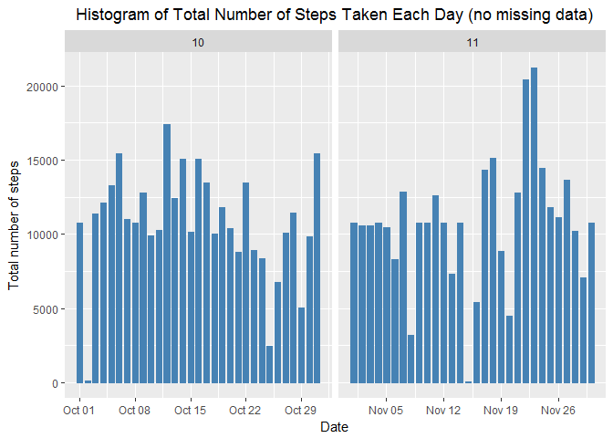

Reproducible Research: Peer Assessment 1
===========================================

Introduction
------------

It is now possible to collect a large amount of data about personal
movement using activity monitoring devices such as a
[Fitbit](http://www.fitbit.com), [Nike
Fuelband](http://www.nike.com/us/en_us/c/nikeplus-fuelband), or [Jawbone
Up](https://jawbone.com/up). These type of devices are part of the
"quantified self" movement -- a group of enthusiasts who take
measurements about themselves regularly to improve their health, to find
patterns in their behavior, or because they are tech geeks. But these
data remain under-utilized both because the raw data are hard to obtain
and there is a lack of statistical methods and software for processing
and interpreting the data.

This assignment makes use of data from a personal activity monitoring
device. This device collects data at 5 minute intervals through out the
day. The data consists of two months of data from an anonymous
individual collected during the months of October and November, 2012 and
include the number of steps taken in 5 minute intervals each day.

Data
----

The data for this assignment can be downloaded from the course web site:

-   Dataset: [Activity monitoring
    data](https://d396qusza40orc.cloudfront.net/repdata%2Fdata%2Factivity.zip)
    \[52K\]

The variables included in this dataset are:

-   **steps**: Number of steps taking in a 5-minute interval (missing
    values are coded as `NA`)

-   **date**: The date on which the measurement was taken in YYYY-MM-DD
    format

-   **interval**: Identifier for the 5-minute interval in which
    measurement was taken

The dataset is stored in a comma-separated-value (CSV) file and there
are a total of 17,568 observations in this dataset.

Assignment
----------

This assignment will be described in multiple parts. You will need to
write a report that answers the questions detailed below. Ultimately,
you will need to complete the entire assignment in a **single R
markdown** document that can be processed by **knitr** and be
transformed into an HTML file.

Throughout your report make sure you always include the code that you
used to generate the output you present. When writing code chunks in the
R markdown document, always use `echo = TRUE` so that someone else will
be able to read the code. **This assignment will be evaluated via peer
assessment so it is essential that your peer evaluators be able to
review the code for your analysis**.

For the plotting aspects of this assignment, feel free to use any
plotting system in R (i.e., base, lattice, ggplot2)

Fork/clone the [GitHub repository created for this
assignment](http://github.com/rdpeng/RepData_PeerAssessment1). You will
submit this assignment by pushing your completed files into your forked
repository on GitHub. The assignment submission will consist of the URL
to your GitHub repository and the SHA-1 commit ID for your repository
state.

NOTE: The GitHub repository also contains the dataset for the assignment
so you do not have to download the data separately.

### Loading and preprocessing the data

Show any code that is needed to

1.  Load the data (i.e. `read.csv()`)

2.  Process/transform the data (if necessary) into a format suitable for
    your analysis

### What is mean total number of steps taken per day?

For this part of the assignment, you can ignore the missing values in
the dataset.

1.  Make a histogram of the total number of steps taken each day

2.  Calculate and report the **mean** and **median** total number of
    steps taken per day

### What is the average daily activity pattern?

1.  Make a time series plot (i.e. `type = "l"`) of the 5-minute interval
    (x-axis) and the average number of steps taken, averaged across all
    days (y-axis)

2.  Which 5-minute interval, on average across all the days in the
    dataset, contains the maximum number of steps?

### Input missing values

Note that there are a number of days/intervals where there are missing
values (coded as `NA`). The presence of missing days may introduce bias
into some calculations or summaries of the data.

1.  Calculate and report the total number of missing values in the
    dataset (i.e. the total number of rows with `NA`s)

2.  Devise a strategy for filling in all of the missing values in the
    dataset. The strategy does not need to be sophisticated. For
    example, you could use the mean/median for that day, or the mean for
    that 5-minute interval, etc.

3.  Create a new dataset that is equal to the original dataset but with
    the missing data filled in.

4.  Make a histogram of the total number of steps taken each day and
    Calculate and report the **mean** and **median** total number of
    steps taken per day. Do these values differ from the estimates from
    the first part of the assignment? What is the impact of imputing
    missing data on the estimates of the total daily number of steps?

### Are there differences in activity patterns between weekdays and weekends?

For this part the `weekdays()` function may be of some help here. Use
the dataset with the filled-in missing values for this part.

1.  Create a new factor variable in the dataset with two levels --
    "weekday" and "weekend" indicating whether a given date is a weekday
    or weekend day.

2.  Make a panel plot containing a time series plot (i.e. `type = "l"`)
    of the 5-minute interval (x-axis) and the average number of steps
    taken, averaged across all weekday days or weekend days (y-axis).
    The plot should look something like the following, which was
    creating using **simulated data**:

**Your plot will look different from the one above** because you will be
using the activity monitor data. Note that the above plot was made using
the lattice system but you can make the same version of the plot using
any plotting system you choose.

Submitting the Assignment
-------------------------

To submit the assignment:

1.  Commit the your completed `PA1_template.Rmd` file to the `master`
    branch of your git repository (you should already be on the `master`
    branch unless you created new ones)

2.  Commit your `PA1_template.md` and `PA1_template.html` files produced
    by processing your R markdown file with `knit2html()` function in R
    (from the **knitr** package)

3.  If your document has figures included (it should) then they should
    have been placed in the `figures/` directory by default (unless you
    overrided the default). Add and commit the `figures/` directory to
    yoru git repository.

4.  Push your `master` branch to GitHub.

5.  Submit the URL to your GitHub repository for this assignment on the
    course web site.

In addition to submitting the URL for your GitHub repository, you will
need to submit the 40 character SHA-1 hash (as string of numbers from
0-9 and letters from a-f) that identifies the repository commit that
contains the version of the files you want to submit. You can do this in
GitHub by doing the following

1.  Going to your GitHub repository web page for this assignment

2.  Click on the "?? commits" link where ?? is the number of commits you
    have in the repository. For example, if you made a total of 10
    commits to this repository, the link should say "10 commits".

3.  You will see a list of commits that you have made to this
    repository. The most recent commit is at the very top. If this
    represents the version of the files you want to submit, then just
    click the "copy to clipboard" button on the right hand side that
    should appear when you hover over the SHA-1 hash. Paste this SHA-1
    hash into the course web site when you submit your assignment. If
    you don't want to use the most recent commit, then go down and find
    the commit you want and copy the SHA-1 hash.

A valid submission will look something like (this is just an
**example**!)

    https://github.com/rdpeng/RepData_PeerAssessment1

    7c376cc5447f11537f8740af8e07d6facc3d9645

### Basic settings

    echo = TRUE  # Always make code visible
    options(scipen = 1)  # Turn off scientific notations for numbers
    knitr::opts_chunk$set(fig.path='figures/',echo=TRUE, cache=TRUE, warning=FALSE, message=FALSE)

### Loading and processing the data

    unzip("activity.zip")
    data <- read.csv("activity.csv", colClasses = c("integer", "Date", "factor"))
    data$month <- as.numeric(format(data$date, "%m"))
    noNA <- na.omit(data)
    rownames(noNA) <- 1:nrow(noNA)
    head(noNA)

    ##   steps       date interval month
    ## 1     0 2012-10-02        0    10
    ## 2     0 2012-10-02        5    10
    ## 3     0 2012-10-02       10    10
    ## 4     0 2012-10-02       15    10
    ## 5     0 2012-10-02       20    10
    ## 6     0 2012-10-02       25    10

    dim(noNA)

    ## [1] 15264     4

    library(ggplot2)

### What is mean total number of steps taken per day?

For this part of the assignment, you can ignore the missing values in
the dataset.

-   Make a histogram of the total number of steps taken each day

<!-- -->

    ggplot(noNA, aes(date, steps)) + geom_bar(stat = "identity", colour = "steelblue", fill = "steelblue", width = 0.7) + facet_grid(. ~ month, scales = "free") + labs(title = "Histogram of Total Number of Steps Taken Each Day", x = "Date", y = "Total number of steps") + theme(plot.title = element_text(hjust = 0.5))

-   Calculate and report the mean and median total number of steps taken
    per day

Mean total number of steps taken per day:

    totalSteps <- aggregate(noNA$steps, list(Date = noNA$date), FUN = "sum")$x
    mean(totalSteps)

    ## [1] 10766.19

Median total number of steps taken per day:

    median(totalSteps)

    ## [1] 10765

### What is the average daily activity pattern?

-   Make a time series plot (i.e. type = "l") of the 5-minute interval
    (x-axis) and the average number of steps taken, averaged across all
    days (y-axis)

<!-- -->

    avgSteps <- aggregate(noNA$steps, list(interval = as.numeric(as.character(noNA$interval))), FUN = "mean")
    names(avgSteps)[2] <- "meanOfSteps"

    ggplot(avgSteps, aes(interval, meanOfSteps)) + geom_line(color = "steelblue", size = 0.8) + labs(title = "Time Series Plot of the 5-minute Interval", x = "5-minute intervals", y = "Average Number of Steps Taken")+ theme(plot.title = element_text(hjust = 0.5))

-   Which 5-minute interval, on average across all the days in the
    dataset, contains the maximum number of steps?

<!-- -->

    avgSteps[avgSteps$meanOfSteps == max(avgSteps$meanOfSteps), ]

    ##     interval meanOfSteps
    ## 104      835    206.1698

### Imputing missing values

-   The total number of rows with NAs:

<!-- -->

    sum(is.na(data))

    ## [1] 2304

-   Devise a strategy for filling in all of the missing values in the
    dataset. The strategy does not need to be sophisticated. For
    example, you could use the mean/median for that day, or the mean for
    that 5-minute interval, etc.

My strategy is to use the mean for that 5-minute interval to fill each
NA value in the steps column.

-   Create a new dataset that is equal to the original dataset but with
    the missing data filled in.

<!-- -->

    newData <- data 
    for (i in 1:nrow(newData)) {
        if (is.na(newData$steps[i])) {
            newData$steps[i] <- avgSteps[which(newData$interval[i] == avgSteps$interval), ]$meanOfSteps
        }
    }

    head(newData)

    ##       steps       date interval month
    ## 1 1.7169811 2012-10-01        0    10
    ## 2 0.3396226 2012-10-01        5    10
    ## 3 0.1320755 2012-10-01       10    10
    ## 4 0.1509434 2012-10-01       15    10
    ## 5 0.0754717 2012-10-01       20    10
    ## 6 2.0943396 2012-10-01       25    10

    sum(is.na(newData))

    ## [1] 0

-   Make a histogram of the total number of steps taken each day and
    Calculate and report the mean and median total number of steps taken
    per day.

<!-- -->

    ggplot(newData, aes(date, steps)) + geom_bar(stat = "identity",
                                                 colour = "steelblue",
                                                 fill = "steelblue",
                                                 width = 0.7) + facet_grid(. ~ month, scales = "free") + labs(title = "Histogram of Total Number of Steps Taken Each Day (no missing data)", x = "Date", y = "Total number of steps")+ theme(plot.title = element_text(hjust = 0.5))

-   Do these values differ from the estimates from the first part of the
    assignment? What is the impact of imputing missing data on the
    estimates of the total daily number of steps?

Mean total number of steps taken per day:

    newTotalSteps <- aggregate(newData$steps, 
                               list(Date = newData$date), 
                               FUN = "sum")$x
    newMean <- mean(newTotalSteps)
    newMean

    ## [1] 10766.19

Median total number of steps taken per day:

    newMedian <- median(newTotalSteps)
    newMedian

    ## [1] 10766.19

Compare them with the two before imputing missing data:

    oldMean <- mean(totalSteps)
    oldMedian <- median(totalSteps)
    newMean - oldMean

    ## [1] 0

    newMedian - oldMedian

    ## [1] 1.188679

So, after imputing the missing data, the new mean of total steps taken
per day is the same as that of the old mean; the new median of total
steps taken per day is greater than that of the old median.

### Are there differences in activity patterns between weekdays and weekends?

-   Create a new factor variable in the dataset with two levels --
    "weekday" and "weekend" indicating whether a given date is a weekday
    or weekend day.

<!-- -->

    head(newData)

    ##       steps       date interval month
    ## 1 1.7169811 2012-10-01        0    10
    ## 2 0.3396226 2012-10-01        5    10
    ## 3 0.1320755 2012-10-01       10    10
    ## 4 0.1509434 2012-10-01       15    10
    ## 5 0.0754717 2012-10-01       20    10
    ## 6 2.0943396 2012-10-01       25    10

    newData$weekdays <- factor(format(newData$date, "%A"))
    levels(newData$weekdays)

    ## [1] "Friday"    "Monday"    "Saturday"  "Sunday"    "Thursday"  "Tuesday"  
    ## [7] "Wednesday"

    levels(newData$weekdays) <- list(weekday = c("Monday", "Tuesday",
                                                 "Wednesday", 
                                                 "Thursday", "Friday"),
                                     weekend = c("Saturday", "Sunday"))
    levels(newData$weekdays)

    ## [1] "weekday" "weekend"

    table(newData$weekdays)

    ## 
    ## weekday weekend 
    ##   12960    4608

-   Make a panel plot containing a time series plot (i.e. type = "l") of
    the 5-minute interval (x-axis) and the average number of steps
    taken, averaged across all weekday days or weekend days (y-axis).

<!-- -->

    avgSteps <- aggregate(newData$steps, 
                          list(interval = as.numeric(as.character(newData$interval)), 
                               weekdays = newData$weekdays),
                          FUN = "mean")
    names(avgSteps)[3] <- "meanOfSteps"
    library(lattice)
    xyplot(avgSteps$meanOfSteps ~ avgSteps$interval | avgSteps$weekdays, 
           layout = c(1, 2), type = "l", 
           xlab = "Interval", ylab = "Number of steps")

